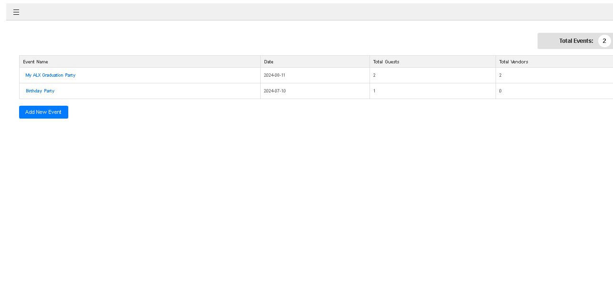
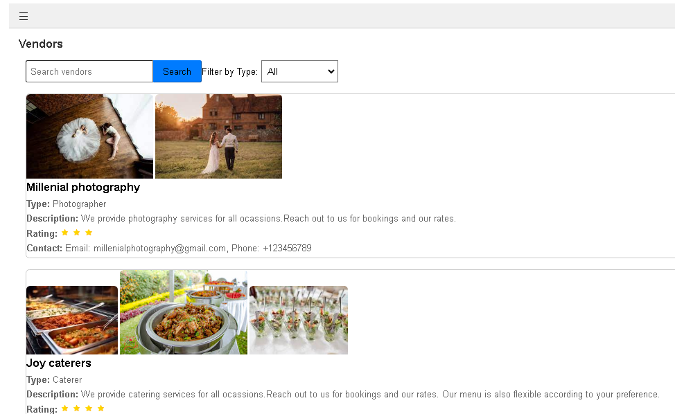
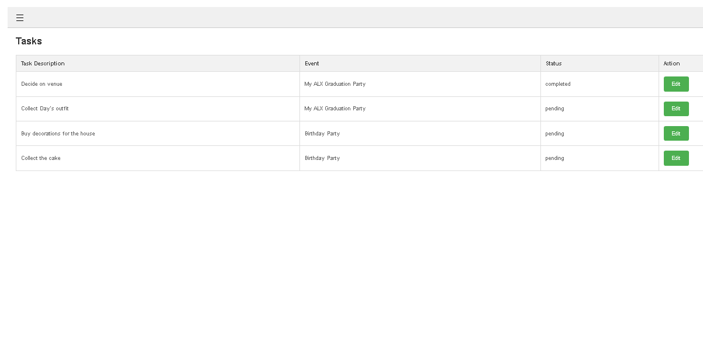
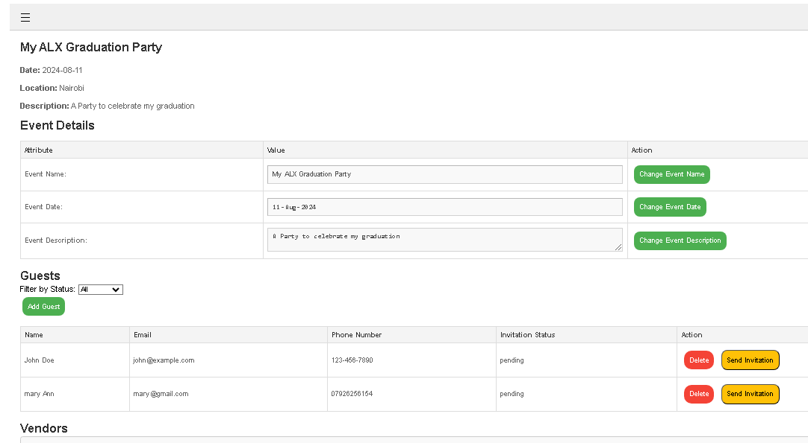

---

# Memorable Events

Memorable Events is a web application designed to help users plan and manage personal social events such as weddings. The application provides features for event planning, task management, vendor management, guest management, sending invitations, and tracking invitation responses.

## Table of Contents

- [Features](#features)
- [Routes](#routes)
- [Screenshots](#screenshots)
- [Contributing](#contributing)
- [Contact](#contact)

## Features

- **Event Management**: Create, update, and delete events.
- **Guest Management**: Add, update, and track guests.
- **Invitation Management**: Send invitations via email and text, and track responses.
- **Vendor Management**: Manage vendors including adding reviews.
- **Task Management**: Add and track tasks related to events.
- **Authentication**: Secure user authentication with login and signup features.
- **Responsive Design**: Accessible on various devices with a responsive design.

## Routes

### Event Management

- `POST /events/` - Create a new event
- `PUT /events/<event_id>` - Update an event
- `DELETE /events/<event_id>` - Delete an event
- `GET /events/<event_id>` - Get event details

### Guest Management

- `POST /guests/` - Add a new guest
- `PUT /guests/<guest_id>` - Update a guest
- `DELETE /guests/<guest_id>` - Delete a guest
- `GET /guests/<guest_id>` - Get guest details

### Invitation Management

- `POST /invite/<guest_id>/<event_id>` - Send an invitation
- `GET /invite/accept/<invitation_id>` - Accept an invitation
- `GET /invite/decline/<invitation_id>` - Decline an invitation

### Vendor Management

- `POST /vendors/` - Add a new vendor
- `PUT /vendors/<vendor_id>` - Update a vendor
- `DELETE /vendors/<vendor_id>` - Delete a vendor
- `GET /vendors/<vendor_id>` - Get vendor details

### Task Management

- `POST /tasks/` - Add a new task
- `PUT /tasks/<task_id>` - Update a task
- `DELETE /tasks/<task_id>` - Delete a task
- `GET /tasks/<task_id>` - Get task details

### Review Management

- `POST /reviews/` - Add a new review
- `PUT /reviews/<review_id>` - Update a review
- `DELETE /reviews/<review_id>` - Delete a review
- `GET /reviews/<review_id>` - Get review details

## Screenshots

### Dashboard

- Use the dashboard to create new events, manage guests, send invitations, add tasks, and review vendors.

### Vendors Page

- Use the vendors page to browse through a comprehensive list of available vendors and choose the best fit for your event!

### Tasks Page

- Use the tasks page to view all tasks for your events, helping you monitor your progress and ensure everything is on track.

### Event Details Page

- Use the event details page to manage your event details, add guests, and view selected vendors—all in one convenient location.

## Contributing

Contributions are welcome! Please read the [contributing guidelines](CONTRIBUTING.md) for more information.

## Contact

For any inquiries, please contact:
- **Name**: [Esther Wagatwe]
- **Email**: [estherwagatwe@gmail.com]
- **Location**: Nairobi, Kenya
